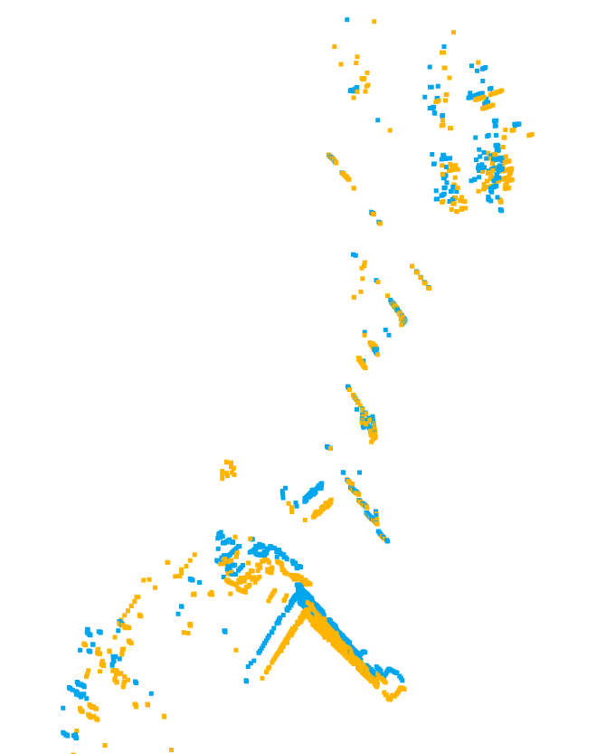
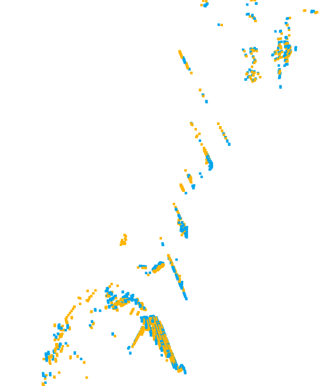
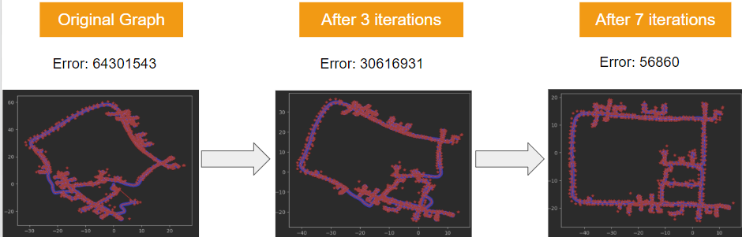
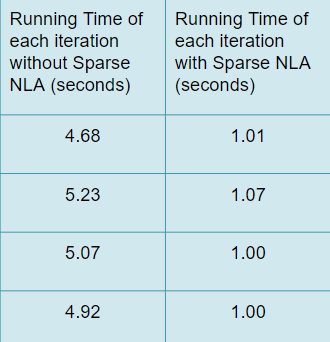

# DSC210_Final_Project_Group15
The Github repository for DSC210 final project. In this project, I will do experiments with different SLAM techniques and look into the roles of numerical linear algebra in modern robotics system.

Part 1: Extended Kalman Filtering

Part 2: Iterative Closest Point

Part 3: Pose graph Optimization

You can go to the EKF_exercise, graph_ex and ICP_ex directories and run the ipynb files in it to visualize our results. The EKF.py, graph.py and ICP.py contains all the implemented functions.
Our experimental results have already been visualize. If you do not run our codes, you can still check our results.

Requried Package
numpy
scipy
matplotlib
sklearn

Dataset: Complex urban dataset, dlt.g2o, icp_data.npz, dataset_2d_landmarks.  The complex urban dataset is stored in the directory urban00

All datasets are already saved in this Github repository. You do not need to download them!

Experimental results

Extended kalman filtering works better than naive estimation with odometry only or measurement only 

We can enhance the performance of extended kalman filtering by tuning parameters such as the covariance matrix

From our experimental results, we find that ICP is a great tool to align points clouds. However, the performance of ICP suffer from outliers and poor initial point associations. By subsampling, threshold and motion prediction, we can use ICP to achieve better results and the algorithm can run in faster speed.

The two pictures shown below are the alignment of point clouds without ICP and the alignment of point clouds with SOTA ICP

Pose graph optimization can help to reduce accumulation errors. Sparse NLA can exploit the sparsify of linear system and improve the efficiency of pose graph optimization algorithms. 

